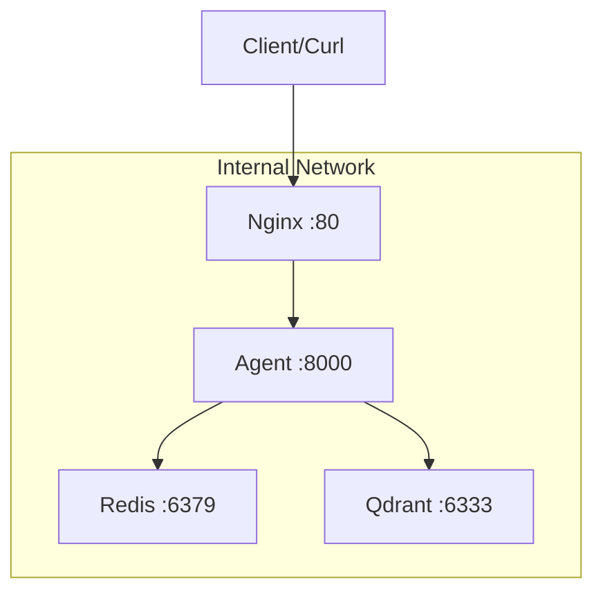

# Day 12 Lab - Mission Answers

## Part 1: Localhost vs Production

### Exercise 1.1: Phát hiện anti-patterns
Qua phân tích mã nguồn `01-localhost-vs-production/develop/app.py`, tôi đã phát hiện 8 vấn đề (anti-patterns) nghiêm trọng ngăn cản ứng dụng chạy ổn định ở môi trường Production:

1.  **Hardcoded Secrets:** API Key (`OPENAI_API_KEY`) và Database URL nằm trực tiếp trong code.
2.  **Environment Inconsistency:** Không sử dụng biến môi trường, dẫn đến xung đột thư viện khi cài đặt (dependencies conflict).
3.  **Hardcoded Host/Port:** Fix cứng `localhost` và cổng `8000`, khiến container/cloud không thể truy cập từ bên ngoài.
4.  **Improper Logging:** Sử dụng `print()` thay vì structured logging, gây khó khăn cho việc giám sát tập trung.
5.  **No Health Checks:** Thiếu `/health` endpoint, khiến hệ thống quản lý cloud không biết khi nào app bị treo để khởi động lại.
6.  **Active Reloader:** Bật `reload=True` ở production gây tốn tài nguyên và tiềm ẩn rủi ro bảo mật.
7.  **Thiếu Input Validation (Lỗi 422):** Không sử dụng Schema (Pydantic), dẫn đến lỗi khi người dùng gửi dữ liệu JSON (body) thay vì query parameter.
8.  **Thiếu Error Handling (Lỗi 500):** Khi gặp lỗi import hoặc logic, app trả về "Internal Server Error" chung chung, không có cơ chế phục hồi.

### Exercise 1.2: Chạy basic version (Observation)
Mặc dù ứng dụng có thể "chạy được" ở Local, nhưng nó gặp các vấn đề sau:
- **Lỗi 422:** Khi test bằng `curl`, app không nhận diện được dữ liệu JSON nếu không truyền đúng kiểu query parameter.
- **Tính dễ vỡ:** Chỉ cần một lỗi nhỏ về môi trường (như thiếu `.env` hoặc sai port) là app sẽ crash hoàn toàn mà không có thông báo rõ ràng.
- **Kết luận:** Phiên bản này **KHÔNG** production-ready.

### Exercise 1.3: So sánh với advanced version

| Feature | Basic (Develop) | Advanced (Production) | Tại sao quan trọng? |
|---------|-----------------|-----------------------|---------------------|
| **Config** | Hardcoded | Env vars (.env) | Bảo mật secrets và linh hoạt thay đổi môi trường mà không cần sửa code. |
| **Health check** | ❌ Không có | ✅ Có (/health) | Giúp Cloud Platform tự động phục hồi ứng dụng khi gặp sự cố. |
| **Logging** | print() | JSON Structured | Dễ dàng quản trị và phân tích lỗi trên các hệ thống giám sát tập trung. |
| **Shutdown** | Đột ngột | Graceful | Đảm bảo các request đang xử lý được hoàn tất trước khi dừng server. |
| **Binding** | localhost | 0.0.0.0 | Cho phép nhận traffic từ Internet hoặc các Container khác. |

---

## Part 2: Docker Containerization

### Exercise 2.1: Dockerfile cơ bản (Định nghĩa)
1. **Base image là gì?** Là môi trường nền tảng (bao gồm hệ điều hành và runtime) được sử dụng làm điểm khởi đầu để xây dựng container image.
2. **Working directory là gì?** Là thư mục làm việc mặc định bên trong container, nơi tất cả các lệnh tiếp theo (`RUN`, `COPY`, `CMD`) sẽ được thực thi.
3. **Tại sao COPY requirements.txt trước?** Để tận dụng cơ chế **Layer Caching** của Docker, giúp tránh cài đặt lại dependencies nếu file này không thay đổi.
4. **CMD vs ENTRYPOINT?** `CMD` cung cấp lệnh mặc định cho container khi khởi chạy và có thể bị ghi đè; `ENTRYPOINT` quy định chức năng chính của container và khó bị ghi đè hơn.

### Exercise 2.2: Build và run (Observation)
- **Image Name:** `my-agent:develop`
- **Dung lượng thực tế:** **1.66 GB**
- **Nhận xét:** Image quá nặng vì chứa toàn bộ bộ công cụ biên dịch và hệ điều hành Debian đầy đủ.

### Exercise 2.3: Multi-stage build
- **Stage 1 (Builder):** Cài đặt build tools (gcc, libpq-dev), biên dịch các thư viện nặng (numpy, pydantic_core) sang thư mục `.local`.
- **Stage 2 (Runtime):** Chỉ copy các gói đã biên dịch từ Stage 1 sang image `slim` mới, loại bỏ hoàn toàn compilers và pip cache.
- **Tại sao image nhỏ hơn?** Do sử dụng base image rút gọn (`-slim`) và kiến trúc tách biệt giữa quá trình build (nặng) và runtime (nhẹ).
- **Dung lượng bản Production:** **236 MB** (Giảm ~85% dung lượng so với bản develop).

### Exercise 2.4: Docker Compose stack

**Architecture Diagram:**

**Các dịch vụ và kết nối:**
- **Services khởi động:** agent (FastAPI), redis (Cache/Session), qdrant (Vector DB), nginx (Proxy/LB).
- **Communication:** Các service giao tiếp qua tên service (DNS nội bộ của Docker). Nginx đóng vai trò Load Balancer điều phối traffic cho Agent.
- **Kết quả test (`http://localhost/health`):** Trả về **`{"status":"ok"}`**. Việc truy cập qua cổng 80 (không cần chỉ định port) chứng minh Nginx đã cấu hình Reverse Proxy thành công, bảo vệ được các dịch vụ nội bộ phía sau.

---

## Part 3: Cloud Deployment

### Exercise 3.1: Railway deployment
- **URL thực tế:** `https://day12ha-tang-cloudvadeployment-production-e653.up.railway.app`
- **Trạng thái:** ✅ Hoạt động (Đã test health check và /ask thành công).
- **Screenshot:** *(Sinh viên tự chụp ảnh Dashboard Railway và đính kèm vào báo cáo).*

### Exercise 3.2: Config comparison (railway.toml vs render.yaml)

| Feature | Railway (railway.toml) | Render (render.yaml) |
|---------|------------------------|----------------------|
| **Định dạng** | TOML | YAML (Blueprint) |
| **Phạm vi** | Cấu hình cho 1 service cụ thể. | Infrastructure as Code (IaC) cho cả stack (Web, Redis...). |
| **Cơ chế Build** | Ưu tiên dùng Nixpacks (tự động nhận diện ngôn ngữ). | Chỉ định rõ `runtime: python` và `buildCommand`. |
| **Quản lý Service** | Thường quản lý lẻ từng service qua giao diện. | Cho phép định nghĩa nhiều service phụ thuộc nhau trong 1 file. |
| **Bảo mật (IP)** | Tự động cấu hình internal network. | **Bắt buộc** khai báo `ipAllowList` cho các dịch vụ như Redis (Lỗi vừa gặp). |

**Nhận xét:** `render.yaml` mạnh mẽ hơn trong việc quản lý hạ tầng phức tạp và cho phép tái sử dụng (Blueprint). Trong khi đó, Railway tập trung vào trải nghiệm "Zero Config" giúp deploy cực nhanh cho các dự án đơn lẻ.

---

## Part 4: API Security

### Exercise 4.1 & 4.2: Authentication (API Key vs JWT)
- **API Key:** Đơn giản, dễ dùng cho tích hợp B2B. Khi thiếu key, hệ thống trả về `401 Unauthorized`.
- **JWT:** Chuyên nghiệp và bảo mật hơn nhờ cơ chế "Stateless". Tôi đã lấy thành công token cho user `student` và dùng nó để xác thực mà không cần gửi lại mật khẩu.

### Exercise 4.3: Rate Limiting
- **Cơ chế:** Sử dụng thuật toán **Sliding Window** (Cửa sổ trượt).
- **Kết quả test:** Khi gọi đến lần thứ 11 trong vòng 1 phút, hệ thống trả về lỗi **`429 Too Many Requests`** đi kèm thông tin `retry_after_seconds`. Điều này giúp ngăn chặn các cuộc tấn công Brute-force hoặc spam API.

### Exercise 4.4: Cost Guard
- **Dữ liệu thực tế từ `/me/usage`:**
    - `input_tokens`: 110
    - `output_tokens`: 318
    - `cost_usd`: 0.000207
- **Ý nghĩa:** Cost Guard đóng vai trò "chốt chặn cuối cùng", đảm bảo rằng ngay cả khi user có quyền truy cập, họ cũng không thể tiêu xài vượt quá ngân sách (1.0 USD/ngày) đã định sẵn, tránh rủi ro "vỡ nợ" hóa đơn LLM.
